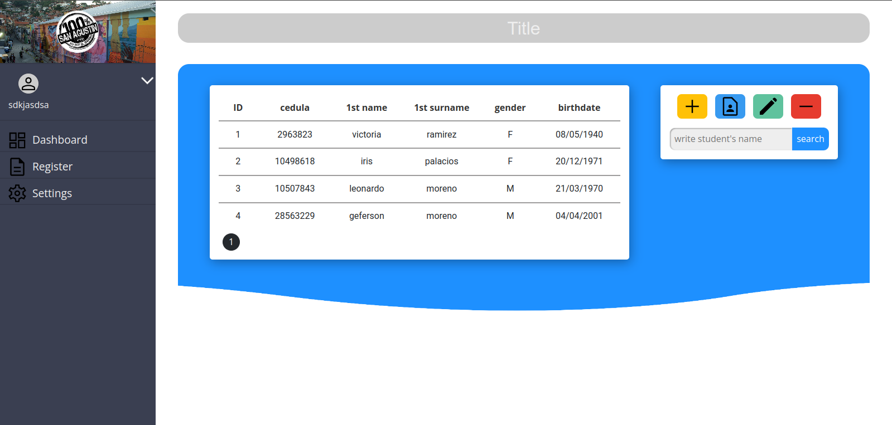
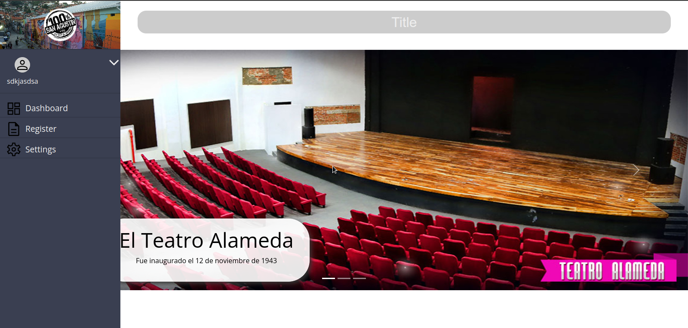

# proyecto MVC
este proyecto es una extension al modelo MVC de la rama [master](https://github.com/geferson0000/proyecto/tree/master)

## resumen del proyecto:

Proyecto de programación que utiliza PHP, Javascript, HTML5, CSS3 y MySQL. Funciona como sistema de gestión administrativo. El proyecto permite la creación de usuarios y el acceso a áreas restringidas para la gestión de información de la empresa. El sistema es seguro y fácil de usar.

## tips de instalacion

* revisar archivo ```config.php``` que es donde se encuentra las variables globales
* verificar si tienes permitido la edicion por archivo ```.htaccess``` si no ayuda [aqui puedes configurar](https://jclopex.medium.com/como-hacer-funcionar-htaccess-en-apache2-y-debian-9-28d16b2ef95a)
  * pero si estas en linux tan solo tienes puedes seguir este ejemplo:
  * ir a esta direccion ```/etc/apacha2/apache2.conf```
  * modificar esta parte del codigo de ese archivo por:

```
<Directory /var/www/>
	Options Indexes FollowSymLinks
	AllowOverride All
	Require all granted
</Directory>
```
* configurar la base de datos como:
  
  * crear una base de datos llamada ```sanAgustin``` con clave ```Op.redo04 ``` or ```root``` y usuario ```root```. 
  * crear una tabla llamada user y la tabla llevara como campos: 
    * id
    * username
    * password

## preview: 


\


\

